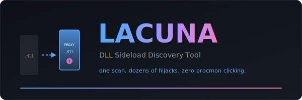

<p align="center">
  
</p>

<p align="center">
  <strong>Automated DLL sideload/hijack discovery for Windows applications.</strong>
</p>

<p align="center">
  <a href="#installation"></a>
  <a href="LICENSE"></a>
  <a href="https://github.com/UnsaltedHash42/lacona/releases"></a>
</p>

Lacuna finds novel DLL search-order hijacking opportunities in installed software. It statically analyzes PE import tables, identifies sideloadable DLLs, generates ready-to-compile proxy DLL source code, and optionally validates findings with canary deployments.

One scan. Dozens of findings. Zero Procmon clicking.

## What It Does

```
$ lacuna scan "C:\Users\you\AppData\Local"

┌─────────────────────────────────────────────────────────────────────┐
│ Static Scan: C:\Users\you\AppData\Local                            │
├──────────────────┬──────────────────────┬──────────────┬───────────┤
│ Host EXE         │ DLL                  │ Type         │ Novel?    │
├──────────────────┼──────────────────────┼──────────────┼───────────┤
│ Signal.exe       │ dxcompiler.dll       │ search_order │ YES       │
│ Discord.exe      │ ffmpeg.dll           │ search_order │ YES       │
│ Obsidian.exe     │ dxcompiler.dll       │ search_order │ YES       │
│ gitkraken.exe    │ dxcompiler.dll       │ search_order │ YES       │
│ GitHubDesktop.exe│ dxcompiler.dll       │ search_order │ YES       │
│ ...              │                      │              │           │
└──────────────────┴──────────────────────┴──────────────┴───────────┘
Total: 784 candidates
```

```
$ lacuna proxy "C:\Users\you\AppData\Local\Programs\signal-desktop\dxcompiler.dll"

Proxy project generated: ./lacuna_output/proxies/dxcompiler/
  source: dxcompiler_proxy.c
  def:    dxcompiler_proxy.def
  build:  build.cmd
  readme: DEPLOY.txt
```

## Features

- **Cross-platform static analysis** — scan PE files from macOS/Linux (no Windows needed for discovery)
- **Extended discovery** — parses delay-load imports and extracts LoadLibrary string references from PE sections
- **Operability scoring** — auto-ranks candidates by exploitation value (writability, auto-start, SYSTEM context, novelty, export count, etc.)
- **Remote validation** — deploy canary DLLs to a remote Windows host over WinRM/SSH, trigger the app, and confirm load + process survival
- **Novelty filtering** — checks findings against [hijacklibs.net](https://hijacklibs.net) to surface only undiscovered hijacks
- **Proxy DLL generation** — complete C source + .DEF file with export forwarders
- **Canary compilation** — build minimal test DLLs to confirm a load path works
- **KnownDLLs filtering** — automatically excludes kernel-protected DLLs that can't be hijacked
- **Export counting** — prioritizes targets by proxy complexity (fewer exports = easier)
- **Signed binary detection** — flags whether the host EXE is Authenticode-signed

## Installation

```bash
# Clone
git clone https://github.com/your-org/lacuna.git
cd lacuna

# Install (Python 3.10+)
pip install -e .

# Optional: cross-compiler for building proxy DLLs
# macOS
brew install mingw-w64

# Linux
apt install mingw-w64

# Windows (already has native compiler, or use msys2)
# mingw-w64 via msys2, or Visual Studio Developer Tools
```

### Requirements

- Python 3.10+
- `pefile` (auto-installed)
- `rich` (auto-installed, for pretty output)
- Optional: `mingw-w64` for cross-compiling canary/proxy DLLs
- Optional: `anthropic` SDK for agentic hunt mode

## Usage

### Scan a directory

Analyze all executables in a directory tree for sideload candidates:

```bash
# Scan user-writable app directories
lacuna scan "%LOCALAPPDATA%"

# Scan a specific application
lacuna scan "C:\Users\you\AppData\Local\Discord"

# Scan exported PE files on macOS/Linux
lacuna scan ./windows-pe-exports/
```

The scanner:
1. Finds all `.exe` files recursively
2. Parses PE import tables (regular + delay-load)
3. Identifies DLLs that exist in the same directory as the EXE (search-order candidates)
4. Identifies phantom DLLs (imported but don't exist anywhere — can be planted)
5. Filters out KnownDLLs and system DLLs that can't be hijacked
6. Checks each finding against hijacklibs.net for novelty

### Generate a proxy DLL

Given a target DLL, generate complete proxy source that forwards all exports to the renamed original:

```bash
lacuna proxy "C:\path\to\target\dxcompiler.dll"

# Custom name for renamed original
lacuna proxy "C:\path\to\ffmpeg.dll" --forward-name "ffmpeg_real.dll"
```

Output is a ready-to-compile project:
- `*_proxy.c` — C source with DllMain payload stub + export forwarding
- `*_proxy.def` — Module definition file for mingw/link.exe
- `build.cmd` — Build script for both MSVC and MinGW
- `DEPLOY.txt` — Step-by-step deployment instructions

### Build and deploy a canary

Compile a minimal test DLL that writes a breadcrumb file on load:

```bash
lacuna canary dxcompiler.dll "C:\Users\you\AppData\Local\Programs\obsidian" \
    --host-exe Obsidian.exe --arch x64
```

Then launch the target app and check for the breadcrumb file. If it appears, the hijack is confirmed.

### Dynamic monitoring (Windows only)

Use Process Monitor to catch runtime DLL loads:

```bash
lacuna dynamic "C:\path\to\app.exe" --duration 30
```

Requires Procmon64.exe on PATH or specified with `--procmon`.

### Suggest targets

Get a list of commonly-deployed enterprise software worth scanning:

```bash
lacuna suggest
lacuna suggest --category rmm
lacuna suggest --system-only
```

### Agentic hunt (experimental)

Full autonomous hunting loop powered by Claude:

```bash
export ANTHROPIC_API_KEY=sk-...
lacuna hunt --context "scanning a dev workstation with git tools and electron apps"
```

## How DLL Search-Order Hijacking Works

When a Windows application loads a DLL, the system searches in this order:

1. **KnownDLLs** registry (kernel-cached, cannot be hijacked)
2. **The application's own directory**
3. System32
4. System directory
5. Windows directory
6. Current directory
7. PATH directories

If an application imports a DLL that exists in its own directory (#2), an attacker can:
1. **Rename** the original DLL (e.g., `dxcompiler.dll` → `dxcompiler_orig.dll`)
2. **Drop** a proxy DLL with the original name
3. The proxy forwards all API calls to the renamed original (app works normally)
4. The proxy also executes attacker code in `DllMain`

This achieves **code execution in the context of a trusted, signed application** — without modifying the executable, without admin privileges (if the app directory is user-writable), and without triggering signature validation failures.

## Proxy DLL Architecture

```
┌──────────────────┐         ┌──────────────────────┐
│   App.exe        │ loads   │   target.dll         │ (proxy)
│   (signed)       │────────>│   - DllMain payload  │
│                  │         │   - Export forwarders │
└──────────────────┘         └──────────┬───────────┘
                                        │ forwards
                                        ▼
                             ┌──────────────────────┐
                             │   target_orig.dll    │ (renamed original)
                             │   - Real exports     │
                             └──────────────────────┘
```

Export forwarding uses `.DEF` files:
```
LIBRARY "dxcompiler"
EXPORTS
    DxcCreateInstance=dxcompiler_orig.DxcCreateInstance
    DxcCreateInstance2=dxcompiler_orig.DxcCreateInstance2
```

The Windows loader resolves forwarders natively — no runtime `LoadLibrary`/`GetProcAddress` needed.

## Key Concepts

### Electron Monoculture

Most Electron apps ship `dxcompiler.dll` (DirectX shader compiler, 2 exports) in their app directory. ONE proxy DLL works against all of them: Signal, Discord, Obsidian, Bitwarden, Notion, Figma, VS Code, GitHub Desktop, GitKraken, Element, Postman, Insomnia, and more.

### ffmpeg.dll

Electron apps also ship `ffmpeg.dll` for media decoding. Despite having 50-73 exports, it loads on startup in many apps and accepts a proxy with forwarders.

### Bundled Git (libiconv-2.dll)

Apps that bundle Git (GitHub Desktop, GitKraken) include `libiconv-2.dll` in their MinGW distribution. Only 10 exports. Fires on every git operation — including background fetches that happen automatically.

### User-Writable Paths

Apps installed to `%LOCALAPPDATA%` or `%APPDATA%` are writable by the current user without elevation. This includes most Electron apps, Spotify, and per-user installs of traditional software.

## Detection Guidance

For defenders looking to detect this technique:

| Indicator | Detection |
|-----------|-----------|
| File size mismatch | Proxy DLLs are ~50KB vs originals (24MB+ for dxcompiler) |
| Export forwarders | Legitimate DLLs rarely forward to `*_orig.*` |
| Rename pattern | `*.dll` → `*_orig.dll` in same directory |
| DLL load source | Sysmon Event ID 7: DLL load from `%LOCALAPPDATA%` with cert mismatch |
| File creation | New DLL appearing in app directory outside of update process |

## Project Structure

```
lacuna/
├── lacuna/
│   ├── cli.py              # Command-line interface
│   ├── models.py           # Data models (HijackCandidate, TargetBinary, etc.)
│   ├── modules/
│   │   ├── static_analyzer.py    # PE import parsing (cross-platform)
│   │   ├── proxy_generator.py    # Proxy DLL source generation
│   │   ├── canary.py             # Canary DLL compilation/testing
│   │   ├── hijacklibs.py         # Novelty checking against hijacklibs.net
│   │   ├── dynamic_monitor.py    # Procmon-based runtime analysis
│   │   ├── target_acquisition.py # Software installation suggestions
│   │   └── windows_enumeration.py # Services, scheduled tasks, autoruns
│   ├── data/
│   │   └── known_dlls_win11.txt  # KnownDLLs list for filtering
│   └── templates/                 # Output templates
├── examples/
│   ├── dxcompiler_proxy/         # Universal Electron proxy example
│   ├── ffmpeg_proxy/             # ffmpeg proxy example
│   └── libiconv_proxy/           # Git bundle proxy example
├── pyproject.toml
└── README.md
```

## Examples

See the `examples/` directory for ready-to-compile proxy DLL projects targeting common application classes.

## Legal & Ethics

This tool is intended for:
- **Authorized penetration testing** and red team engagements
- **Purple team** exercises evaluating detection capabilities
- **Security research** into DLL search-order vulnerabilities
- **Vendor notification** of sideload vulnerabilities in shipped software

Do not use this tool against systems you do not own or have explicit written authorization to test.

## Acknowledgments

- [hijacklibs.net](https://hijacklibs.net) by Wietze Beukema — the definitive DLL hijack knowledge base
- [pefile](https://github.com/erocarrera/pefile) — cross-platform PE parsing
- The DLL proxy/sideloading technique is well-documented in MITRE ATT&CK as [T1574.001](https://attack.mitre.org/techniques/T1574/001/) and [T1574.002](https://attack.mitre.org/techniques/T1574/002/)

## License

MIT
